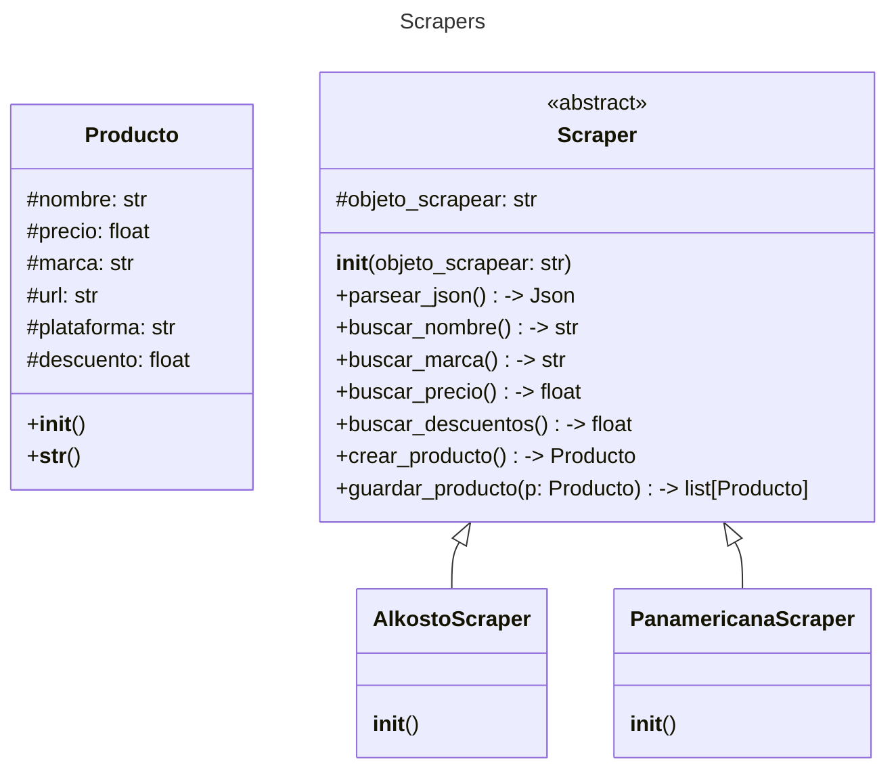
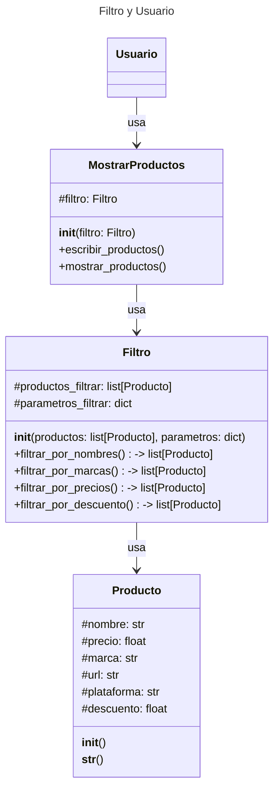
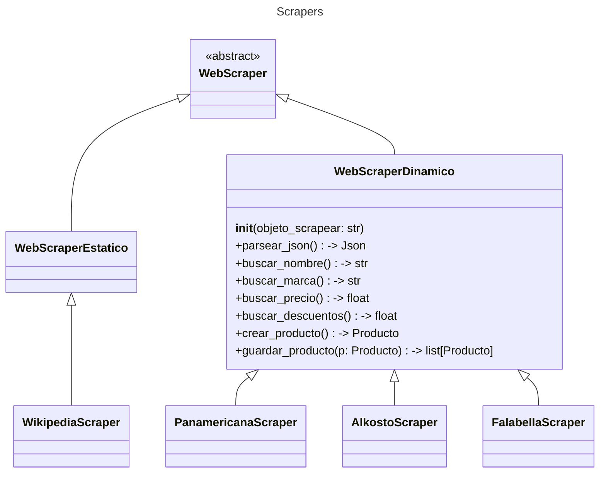
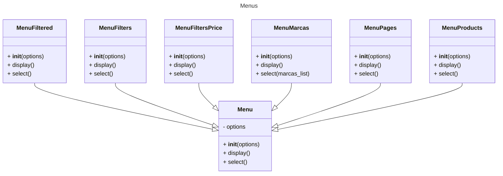

# Nombre del equipo-Alternativa definida: Serial Experiments POO - Alternativa 2

# Nombre del proyecto: Search While Rest


## Descripción del Proyecto

Este proyecto consiste en una aplicación basada en un sistema de web scraping, cuyo objetivo es filtrar la búsqueda de periféricos para computadoras de acuerdo con los criterios y preferencias proporcionados por el usuario. Los perifericos en especifico seran los audifonos, los teclados y los "mouse"


Las variables que se tienen en cuenta son:

- Precio

- Marca

- Modelo

- Disponibilidad

- Descuento (si aplica)


La aplicación facilita la búsqueda de productos para el usuario. Para ello, realiza la recolección de datos desde plataformas de comercio electrónico como Alkosto,   Panamericana.


## Por que se eligio

En algunas ocaciones se pierde mucho tiempo al buscar este tipo de perifericos, puesto que en cada pagina los precios varian, y pueden haber descuento o cobrar por envio, es por esto que es mejor hacer un "scrapper" que pueda ahorrar tiempo a este tipo de productos. 


# Solucion preliminar
## Diagrama de Clase 1: Funcionamiento del scrapper


## Diagrama de Clase 2: Relacion con el usario


## Librerias fundamentales
### Beautif Soup + Requests

Uso de librerias: Request, Beatiful Soap, Selenium:
-Requests: se usa para obtener el contenido de la web haciendo una peticion  HTTP, y luego poderlo parsear usando otra libreria. Esta libreria es muy buena y muy confiable. Solo se puede utilizar cuando el contenido se carga estaticamente, es decir esta en la estructura HTML

-BeatifulSoap: Esto se usa para parsear las paginas web, es decir para  analizar y extraer el json del html, en caso de que se nescecite. La libreria es ampliamente utilizada y recomendada, ademas no es dificil de utilizar


Con beautiful soap la idea es hallar y extraer estos scrips que contienen toda la informacion, aqui se muestra el ejemplo con panamericana

## Selenium

-Selenium: Se usa para controlar a un navegador desde Python (depende de lo que la pagina pida)

Esto es util para cuando requests no funciona, debido a que en algunas paginas, todo el contenido se carca dinamicamente por medio de JSON. 


# Solucion Definitiva :v
Se mostraran aspectos importantes de la solucion definitiva:
# Diagramas de clase

# Web scrappers dinamicos (corresponden a una pagina web de servicios) 
## Panamericana Scrapper (pseudo dinamico): 
La funcion mas importante se presenta a continuacion, esta funcion busca el json de "respuesta" que da la pagina luego de conectarse. Para esto se usan las librerias Request y BeatifulSoup
```python

 def parsear_json(self) -> None:
        self.__data = []
        if self._objeto == "audifonos":
            url = "https://www.panamericana.com.co/audifonos?_q=audifonos&map=ft&"
        elif self._objeto == "mouse":
            url = "https://www.panamericana.com.co/mouse?_q=mouse&map=ft&"
        elif self._objeto == "teclado":
            url = "https://www.panamericana.com.co/teclado?_q=teclado&map=ft&"
        try:
            page = 1
            ####? Se usa un while True para recorrer pagina por pagina 
            while True:
                print(f"Scrapeando pagina {page}")
                url_modified = url + f"page={page}"
                response = requests.get(url_modified, timeout=10)

                if response.status_code != 200:
                    raise ConnectionError("No se pudo conectar")
                soup = BeautifulSoup(response.text, "lxml")
                scripts = soup.find_all("script", type="application/ld+json")

                #! En esta seccion de codigo se encuentra el BREAK, el detalle de eso esta en el github
                try:
                    raw_data = json.loads(scripts[1].string)
                except IndexError:
                    print(f"La pagina {page - 1} es la ultima pagina")
                    break

                self.__data.append(raw_data)
                page += 1

        except (requests.exceptions.Timeout, requests.exceptions.ConnectTimeout) as error:
            print(f"Existe este {error}")
        except KeyboardInterrupt as f_error:
            print(f"{f_error}")

```
### API PANAMERICANA 
Imagen de la structura Json de PANAMERICANA


### While y Break
Un problema que sucedio es que los productos estan separados por paginas, es decir distintos links con un numero distinto, entonces para esto se aplica la funcion WHILE, que con un contador va recorriendo cada pagina. Es importante mencionar que el Break, se hizo asi porque normalemente request saca dos scripts, pero cuando la pagina no contiene productos el segundo script (por eso el indice [1]), entonces asi identifico cual #page tenia los elementos. 

###  Excepciones
Se usan excepciones en todas las funciones, por si ocurre un error no se afecta el parseo (en especial la primera funcion, la mas importante) Existen algunas respuestas personalizadas de la libreria request.

### Python y las List_C
Para implementar las funciones que buscan cierto tipo de datos, se uso list_C, esto se debe a que luego de hacer el codigo con varios for, se reflexiono de la facilidad que las List_C daban. Posteriomente se muestra una comparacion tomando como ejemplo la funcion Buscar_Precio

### List_C
```python

    def buscar_precio(self) -> list:
        try:
            self.__precios = [
                item["price"]
                for Json in self.__data
                for product in Json["itemListElement"]
                for item in product["item"]["offers"]["offers"]
            ]
        except Exception as error:
            print(f"Hay error {error}")
```

### No List_C
```python

def buscar_precio(self) -> list:
        self.precios = []
        try:
            for Json in self.data:
                d_1 = Json["itemListElement"]
                for product in d_1:
                    self.second_step = product["item"]
                    third_step = self.second_step["offers"]
                    fourth_step = third_step["offers"]
                    for item in fourth_step:
                        price = item["price"]
                    self.precios.append(price)
        except Exception as error:
            print(f"Hay error {error}")
```
## Fallabela Scrapper (pseudo dinamico): 
Con fallabela tambien sucede algo similar a panamericana, busco la API que la pagina genera al solicitar los datos al servidor. Por esta razon tambien puedo utilizar request + Beautiful Soup.
```python

 def parsear_json(self) -> None: 
        self.__data = []

        if self._objeto == "audifonos":
            url = "https://www.falabella.com.co/falabella-co/category/cat50670/Audifonos?sred=audifonos&"
        elif self._objeto == "mouse":
            url = "https://www.falabella.com.co/falabella-co/search?Ntt=mouse&"
        elif self._objeto == "teclado":
            url = "https://www.falabella.com.co/falabella-co/search?Ntt=teclado&"

        headers = {"User-Agent": "Mozilla/5.0"}
        
        try:
            page = 1
            while True:
                print(f"Scrapeando pagina {page}")
                url_modified = url + f"page={page}"
                response = requests.get(url_modified, headers=headers, timeout=10)
                if response.status_code != 200:
                    raise ConnectionError("No se pudo conectar")

                soup = BeautifulSoup(response.text, "lxml")
                script = soup.find("script", attrs={"id": "__NEXT_DATA__"})
                raw_json = json.loads(script.get_text())

                ##! En este codigo se encuentra el BREAK, el pq de esto se encuentra en el git
                try:
                    productos = raw_json["props"]["pageProps"]["results"] 
                except KeyError:
                    print(f"La pagina {page - 1} es la ultima pagina")
                    break

                self.__data.append(productos)
                page += 1
                
        except (requests.exceptions.Timeout, requests.exceptions.ConnectTimeout) as error:
            print(f"Existe este {error}")
        except KeyboardInterrupt as f_error:
            print(f"{f_error}"
```
### API Falabella 

Como se puede ver la API de fallabela es completamente diferente a la de panamericana, por lo que todos los metodos van a ser diferentes. 

### List_C
```python

    def buscar_marca(self) -> list:
        try:
            self.__marcas = [
                producto["topSpecifications"][0]
                if len(producto["topSpecifications"]) != 0
                else "No se encontro la marca"
                for lista_productos in self.__data
                for producto in lista_productos
            ]
        except Exception as error:
            print(f"Hay error {error}")
```

### No List_C
```python

def buscar_marca(self) -> list:
        self.marcas = []
        try:
            for Json in self.data:
               for d_1 in Json:
                   first_step=d_1["topSpecifications"]
                   if len(first_step) != 0:
                    d_2=first_step[0]
                    self.marcas.append(d_2)
                   else: 
                       self.marcas.append("No se encontro la marca")
        except Exception as error:
            print(f"Hay error {error}")
```
### While y Break
Se hizo algo similar de lo que se hizo con Panamericana, solo que en Falabela cuando las paginas se acaban, la llave del diccionario que contiene al JSON de toda la informacion no existe y por eso se usa el break con un Key error

## Alkosto Scrapper (dinamico de verdad)
A diferencia de los dos anteriores, en alkosto no se puede usar request, porque la pagina carga todo desde un archivo dinamico JSON. Por lo que toca utilizar selenium, Posteriormente se muestra la funcion para simular chrome y extraer los datos. 
```python

class AlkostoWebScrapper(WebScrapperDinamico):
    def __init__(self, objeto: str):
        super().__init__(objeto)
        self.pagina = "Alkosto"

    ##! Aqui pongo las opciones del "Web Driver"
    def parsear_json(self):
        option = Options()
        option.add_argument("--headless")
        option.add_argument("--log-level=3")
        self.driver = webdriver.Chrome(options=option)

        if self._objeto == "audifonos":
            self.driver.get("https://www.alkosto.com/search?text=audifonos")
            time.sleep(5)
```
### Como se busca?
Con este scraper se busca sobre la estructura HTML, entonces se puede buscar por "clase" o por "path", en este scrapper se utiliza ambos. Esa es la principal diferencia entre los dos primeros y este 
```python

   def buscar_marca(self):
        marcas = self.driver.find_elements(By.CLASS_NAME, "product__item__information__brand")
        if not marcas:
            raise Exception("No se encontró ninguna marca.")
        self.marcas = [marca.text for marca in marcas]
```
### List_C
En este scrapper las list_c son mas comprensibles, que en los dos anteriores. Lo unico raro es el if, este si en el "contenedor" existe algo (ya sea un str, un int lo que sea) saca un True si no saca un false
```python

    def buscar_descuento(self):
        descuentos = self.driver.find_elements(By.CLASS_NAME, "label-offer")
        if not descuentos:
            raise Exception("No se encontró ningún descuento.")
        self.descuentos = [
            d.text.strip() if d.text.strip() else "0%" for d in descuentos
        ]
```
## Como se guarda la informacion?
Estos tres scrappers guardan la informacion en una estructura de python llamada named_tuple, que es la combinacion de un objeto con una tupla, esto se debe a que este dato permite organizar la informacion (como si fuera un objeto con .), sigue siendo liegro (es una tupla) y tambien es inmutable, una caracteristica buena para los scrappers. Se muestra un ejemplo
```python

def crear_productos(self) -> list:
        self.products = []
        product = namedtuple(f"{self._objeto}", ["pagina", "nombre", "marca", "precio", "descuento", "link", "disponibilidad"])

        for i in range(len(self.names)):
            precio_limpio = int(self.precios[i][0].replace(".", ""))

            p = product(
                self.pagina,
                self.names[i],
                self.marcas[i],
                precio_limpio,
                self.descuentos[i],
                self.links[i],
                "In stock"
            )
            self.products.append(p)
        return self.products
```
## Wikipedia (el verdadero scraper estatico)
El scraper de wikipedia es muy sencillo simplemente se obtiene la informacion con requests (porque es estatico), y se busca dependiendo del html con BS4 (es diferente a Alkosto pq este no se puede acceder con requests)
```python

   #! Funcion mas importante
    def parsear_pagina(self):
        if self._objeto == "audifonos":
            url = "https://es.wikipedia.org/wiki/Audífono"
        elif self._objeto == "mouse":
            url = "https://es.wikipedia.org/wiki/Ratón_(informática)"
        elif self._objeto == "teclado":
            url = "https://es.wikipedia.org/wiki/Teclado_(informática)"

        self.response = requests.get(url, timeout=10)
        if self.response.status_code != 200:
            raise ConnectionError("No se pudo conectar")  
        self.soup=BeautifulSoup(self.response.text, "html.parser")
  ```
## Diagrama de Clase 3: Menus para aplicar filtros durante la busqueda de productos

## Menu
Con el fin de proporcionar resultados específicos, optamos por proporcionar una serie de clases que heredan directamente de la clase abstracta Menu
``` python
class Menu:
    def __init__(self, options):
        self.options = options
    def display(self):
        pass
    def select(self):
        pass
```
Los diferentes tipos de Menus que posee nuestro programa son
- [Menu Pages]
- [Menu Products]
- [Menu Marcas]
- [Menu Filters]
- [Menu Filtered]
- [Menu Filters Price Order]
