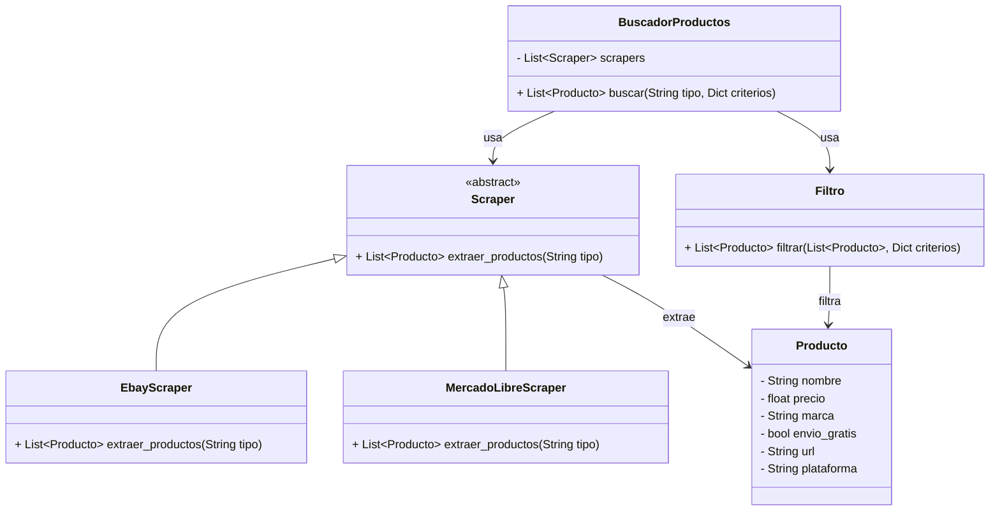

# Nombre del Proyecto

## Descripción del Proyecto

Este proyecto consiste en una aplicación basada en un sistema de web scraping, cuyo objetivo es filtrar la búsqueda de periféricos para computadoras de acuerdo con los criterios y preferencias proporcionados por el usuario. Los perifericos en especifico seran los audifonos, los teclados y los "mouse"

Las variables que se tienen en cuenta son:

- Precio

- Empresa fabricante

- Modelo

- Año de lanzamiento

- Funcionalidades

La aplicación facilita la búsqueda de productos para el usuario. Para ello, realiza la recolección de datos desde plataformas de comercio electrónico como MercadoLibre, Ebay, Panamericana.

## Por que se eligio

En algunas ocaciones se pierde mucho tiempo al buscar este tipo de perifericos, puesto que en cada pagina los precios varian, y pueden haber descuento o cobrar por envio, es por esto que es mejor hacer un "scrapper" que pueda ahorrar tiempo a este tipo de productos. 

## Diagrama de Clases

