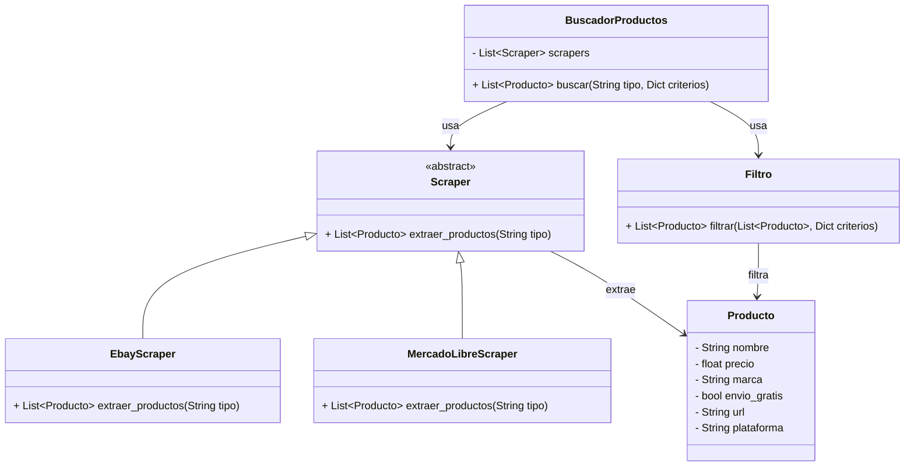

# Nombre del Proyecto

## Descripción del Proyecto

Este proyecto consiste en una aplicación basada en un sistema de web scraping, cuyo objetivo es filtrar la búsqueda de periféricos para computadoras de acuerdo con los criterios y preferencias proporcionados por el usuario.

Las variables que se tienen en cuenta son:

- Precio

- Empresa fabricante

- Modelo

- Año de lanzamiento

- Compatibilidad

- Funcionalidades

- Software incluido (si aplica)

La aplicación facilita la búsqueda de productos ideales para el usuario, garantizando una buena relación calidad-precio. Para ello, realiza la recolección de datos desde plataformas de comercio electrónico como MercadoLibre y Amazon.

## Diagrama de Clases

